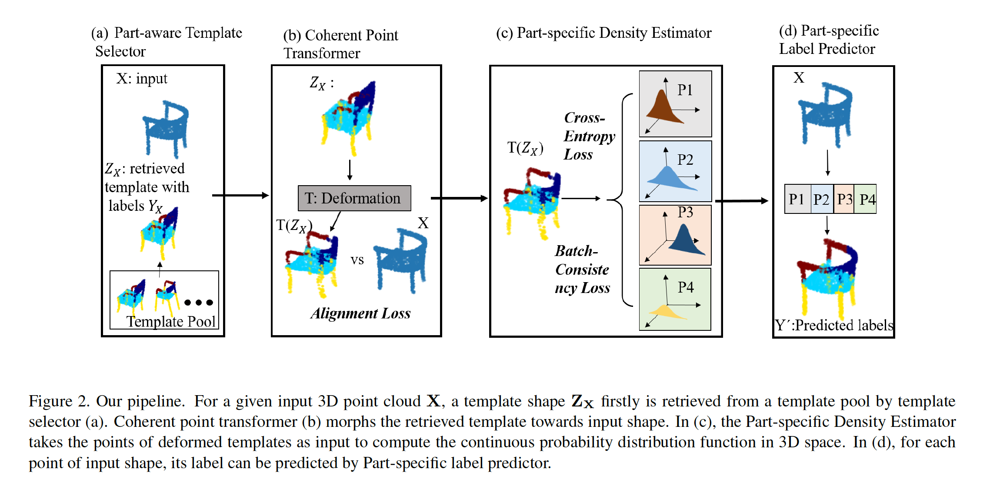
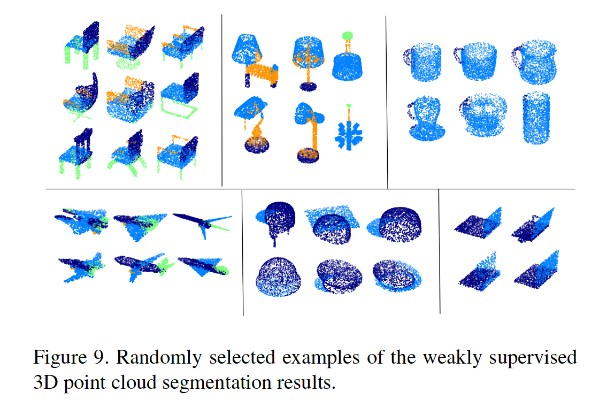

# Few-shot Learning of Part-specific Probability Space for 3D Shape Segmentation


Introduction
------------
This is the source code for our paper **Few-shot Learning of Part-specific Probability Space for 3D Shape Segmentation**


Network Architecture
--------------------
The architecture of our proposed model is as follows



--------------------
Illustration of shape morphing.


## Installation
* Our code is tested on Tensorflow>1.4 and CUDA 8.0 

* Clone this repo
```
git clone https://github.com/Lingjing324/Few-Shot-Learning-of-Part-Specific-Probability-Space-for-3D-Shape-Segmentation.git

```
## Dataset
* Download the ShapeNet part dataset from https://www.shapenet.org/
run notebook file data_preprocessing.ipynb to prepare the tfrecords.
or: https://github.com/charlesq34/pointnet/blob/master/part_seg/download_data.sh


## Training & Test
run the notebook: train_eval.ipynb


## Citation

If you find this useful in your research, please consider citing:

    @inproceedings{wang2020few,
	  title={Few-Shot Learning of Part-Specific Probability Space for 3D Shape Segmentation},
	  author={Wang, Lingjing and Li, Xiang and Fang, Yi},
	  booktitle={Proceedings of the IEEE/CVF Conference on Computer Vision and Pattern Recognition},
	  pages={4504--4513},
	  year={2020}
	}
